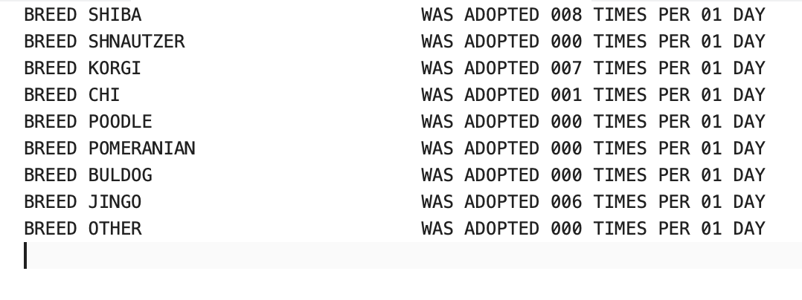
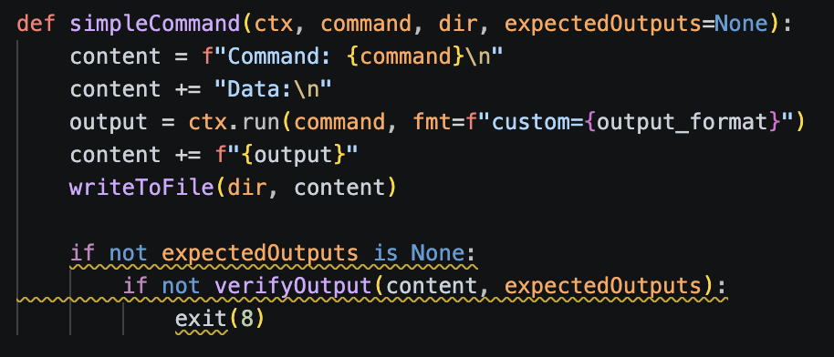
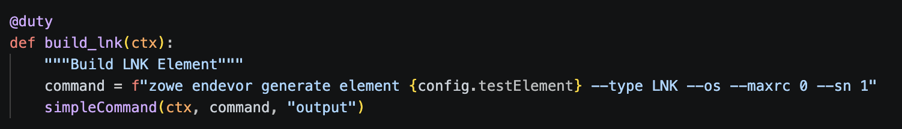
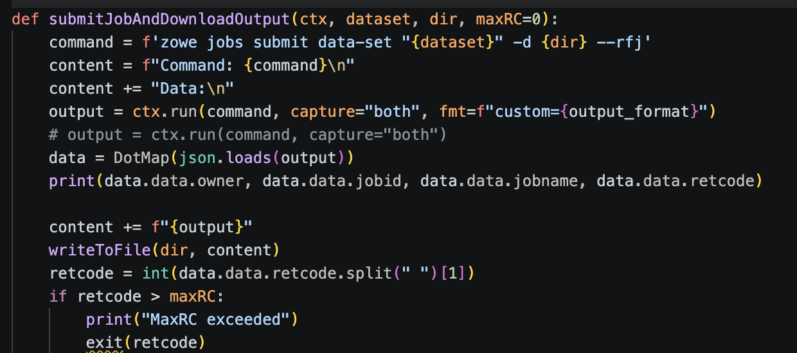
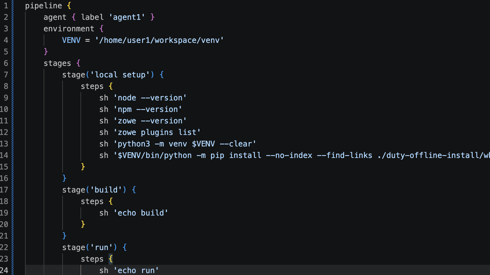
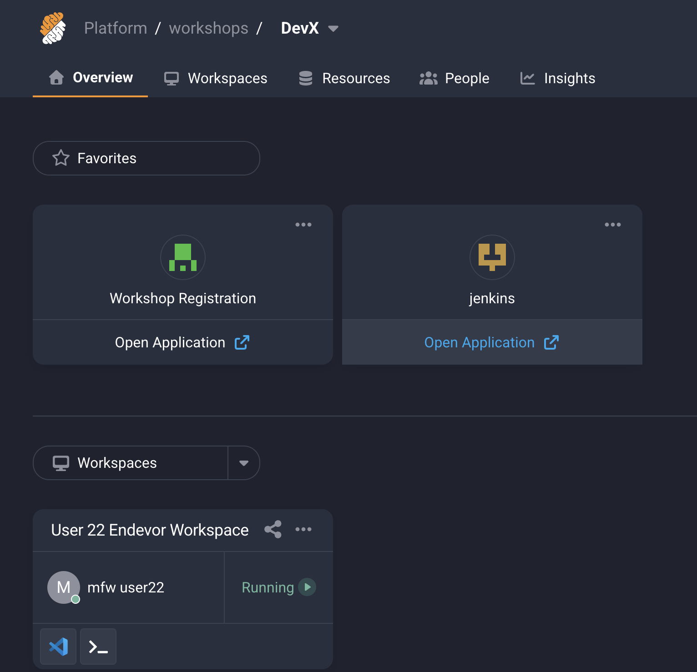
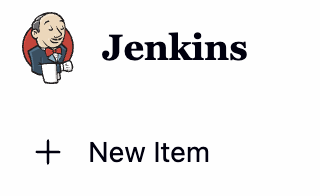
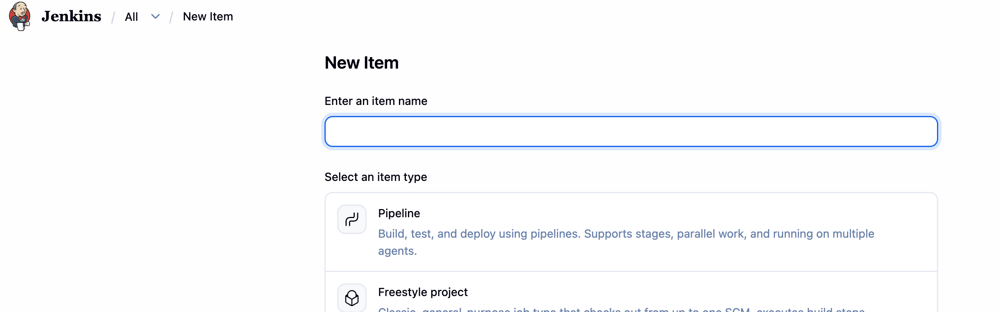
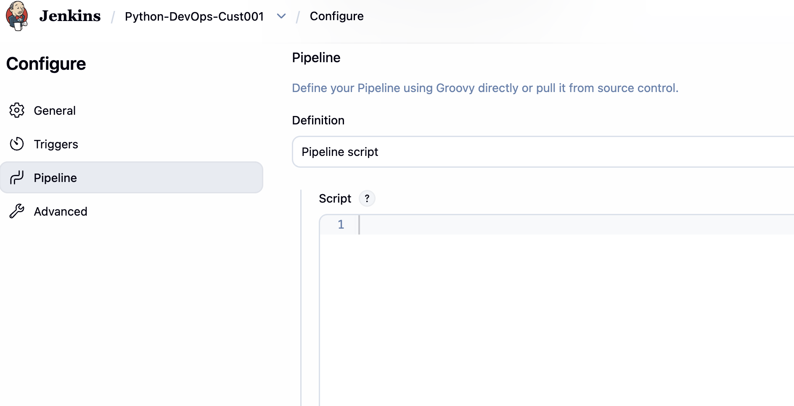
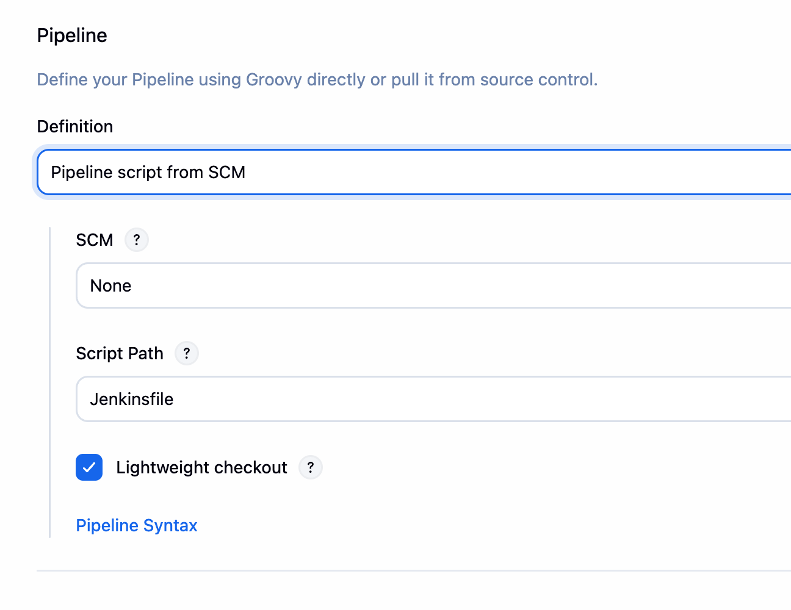

# Zowe CICS Workshop: Automate Mainframe Apps with Jenkins and Zowe

## 1. Goals

- Write automation scripts for mainframe app to build and deploy
- Build a Jenkins CI/CD pipeline for mainframe app

## 2.  Accessing the environment.
- The system is located at https://sn.ws.broadcom.com
- Your login: is mfwsuser30@demo.broadcom.com
- The password is Handsonlab@2026

One you log in, select the environment:


## 3. z/OS Services

- You have been assigned a single set of login credentials for accessing all of the Mainframe resources on a remote z/OS LPAR which is hosted by Broadcom.

- Your userid is CUST030.
- Your password CUST030.

Service                                                                                                                                                            Connection Information (Host:Port)
z/OSMF                                                                                                                                                             TODO:1443
CA Endevor                                                                                                                                                         TODO:6002

This is just information for you.  The details have been stored in your zowe.config.json file for you.

## 4. DOGGOS
If you have been to previous Broadcom workshops, you may be familiar with DOGGOS.  It's an application to track dog adoptions.  This version is a batch application.  The assets are tracked in Endevor.  Rather than spending time modifying the application, we are going to simply build and execute the application.  After that, the application will be deployed and run, via some job actions.  

As part of your learning, the important aspects are understanding how to automate commands (such as downloading code, generating code) and jobs (submitting, downloading output).

Finally, we want to automate the job so it can be run from a pipeline tool, such as Jenkins.  

## 5. Developer Environment

- Access the terminal using the Hamburger menu (three horizontal lines on the upper right), Terminal, New Terminal.  A terminal will be displayed at the bottom of the screen.
  - Issue `zowe --h`
  - Issue `zowe plugins list`
  - Issue `npm -h`
  - Issue `git help`
  - Issue `duty --help`

  - We will be using Duty, a Python framework, to automate our actions.  

## 6. Building the code.  

In order to automate the build of an application, we need to build it manually first.  Our application has 2 parts, a COBOL file, which has dependencies on COPYBOOKS.  And it also has an LNK file.  We must build each of those manually to ensure we don't have any errors.

- Run the following commands and ensure we get a 0000 return code:
  - `zowe endevor generate DOGGOS30 --type COBOL --os --maxrc 0 --sn 1 --cb`
  - `zowe endevor generate DOGGOS30 --type LNK --os --maxrc 0 --sn 1 --cb`

- This command uses Zowe to interact with Endevor.  We pass the command, `generate` and it takes an element name as a parameter.  
- We pass the following options:
  - `--type` determines the element type to work with.
  - `--os` overrides signout, in case someone else has it signed out.  This is a demo environment, and the items can sometimes be signed out by someone else.
  - `--maxrc` is used to say the maximum return value allowed before returning an error.
  - `--sn` this is the environment stage number
  - `--cb` is copy-back.  If the element is somewhere up the map, it will bring it back to DEV Stage 1.

If you have any issues with these commands, reach out to the instructions.

## 7. Running the Application
- This is a batch application.  Once it is compiled, this application is ready to run.

- To execute the application and see the output, we can call `zowe jobs`.
  - `zowe jobs submit dataset CUST030.PUBLIC.JCL(NDRUNDOG) --vasc`

- `--vasc` is a great command when testing.  The output is displayed across your screen when the job completes.  For jobs like this one, we can see the job output and ensure the application runs. 

- You should see output with dog adoptions like this:


## 8. Reporting for Duty
Now that you've used the CLI to successfully make code changes and perform generates on Endevor, it's time to automate these steps. CLI commands can be embedded in scripts that you can run repeatedly from your local machine. These same scripts can also be called from CI/CD tools like Jenkins. Task Runners are a way to organize and interact with your automation scripts more easily.


We will be using a Python based Task Runner called duty for this section. Task Runners can also be called from CI/CD tools like Jenkins

- Note: Task Runners are an abstraction layer over scripts. They are helpful but are not a necessity.

This project uses [`duty`](https://pypi.org/project/duty/) task runner to wrap a set of Zowe CLI
commands used to build and run a COBOL/Endevor element on a mainframe, then archive the results.

It is written in Python and has components that are already installed in this environment. 

Duty has a command line option that makes it easy to incorporate addition tasks, which link to commands.

- Run `duty --help` to see the available command. 


## 9.  Duties Structure - Imports
Open the duties.py file to see the current implementation.

The top of the file contains import statements. These import libraries to support a functionality.

- At the top of the duties.py, take note of three packages that we are using:
  - `import sys`:  Accesses files and system resources
  - `import duty`: Imports the duty library files
  - `import zowesupport`: A set of helper files to run zowe commands, keeping the duties file simple and easy to understand. 

## 10.  Duties Structure - Tasks
- Duty is a library of functions.  Without getting too detailed, there's a decorator (@duty) that tells Python the next function is part of the Duty task runner.  
- Python is indention based, similar to COBOL.  Indentation matters. 
- "def build_cobol(ctx):" is a function.
  - def: Declares we are creating a function
  - build_cobol: This is the function name
  - (ctx): This is a list of parameters.  In this case, we are passing a context object.  You'll also see that for the commands we call.

- """ ... """ indicates a multiline comment.  Using Duty, it is also the description of the task we are calling.  This is a user friendly term used when accessing duty.  

- When the indentation returns to the first column, the previous function ends.  

## 11. Decorators
The decorator @Duty defines the next function as the task name.

Looking at the current implementation of build_cobol:
```python
@duty
def build_cobol(ctx):
    """Build Cobol Element"""
    command = "echo build cobol"
    simpleCommand(ctx, command, "output")
```

This creates a Duty task named `build-cobol`.  
The `command=` is a string that details the command we want to run. 
The `simpleCommand` runs the command and stores the output in a folder called "output"

## 12. Understanding Simple Command


- It's important to understand how the simpleCommand works.  
- Using your mouse, right click on simpleCommand.
  - VS Code will open the "zowesupport.py" file and take you to the definition of simpleCommand().

- simpleCommand takes 4 parameters:
  - ctx: The context object for Duty.
  - command: The command to run
  - dir: A directory to write output to.  This is especially useful if you are trying to debug problems.
  - expectedOutputs: This allows us to validate output of the command, if desired.

- This function creates a text variable called output.  It collects all the output from the command, including the command actually called.  It creates a simple format, making it easy to read.
- output = ctx.run(...):  This actually runs the command.  The first parameter is the command to run (passed from simpleCommand).  The second is for formatted output.
- content += : This is a shortcut for appending information to the content variable.
- writeToFile: This calls another function, which writes the content to an output folder.
- if not expectedOutputs: This is used when looking for specific output.  If it doesn't find the output, it ends the application and says why.

Close zowesupport.py.

## 13. Automating the Builds.
Using the `def build_cobol(ctx):` function, let's modify the command line. 
It currently shows `command = "echo build cobol"` but we need it to run the build command we used earlier.

There's a feature in Python strings called interpolation.  It's a fancy word for using symbols to substitute variable values.  Instead of regular string concatenation, this allows us to write everything in-line, making it more readable.  Interpolated strings start with f like f"This is my {varname}".

Let's change the command string to look like our command, but let's import values from a configuration file.  We are using `config.json` to contain value names.  So, if we pass config.value, it will substitute the value for us.

This allows us to reuse the same file and simply change the configuration file to work with similar applications.

Open the config.json file and note it contains values like "Element".

Close the file and back in duties.py, let's modify that command value in the build-cobol section to look like:

`command = f"zowe endevor generate element {config.element} --type COBOL --os --maxrc 0 --sn 1 --cb"`

Save the file, and in the terminal run:
`duty build-cobol`

It should return with output that looks like this:


## 14. Updating Build-Lnk
We've successfully build the COBOL program in the last step.  We can literally copy the same `command=` line and paste it into the `build-lnk` section and modify it.

Make it look like this:
`command = f"zowe endevor generate element {config.element} --type LNK --os --maxrc 0 --sn 1 --cb"`

The entire function should look like this:
```python
@duty
def build_lnk(ctx):
    """Build LNK Element"""
    command = f"zowe endevor generate element {config.element} --type LNK --os --maxrc 0 --sn 1 --cb"
    simpleCommand(ctx, command, "output")
```

If you are interested in seeing the output of the compile commands, you can view the output in the output folder.  There's a file for each run.  It will detail the command run and any output, including errors.

Run `duty build-lnk` and ensure you get a successful run.

## 15. Simplifying the Build.
Let's take the duty build-cobol and duty build-lnk tasks and combine them into a single duty task. 
  - duty tasks can call any function, including the tasks created in the duty file

The following duty task combines the existing build tasks into a single duty build task:
  """text 
  @duty
  def build(ctx):
    """Build the application"""
    build_cobol(ctx)
    build_lnk(ctx)
  """
- Ensure the build task and description appear when you issue:
  - `duty --help`
- Ensure the build task runs both the build-cobol and build-lnk tasks without error when you issue:
  - `duty build`



We can now build one or more components with a single command.  And each command output it tracked separately within the output folder.

## 16. Let's run the application
Last time we ran the application, in the command line we executed:
`zowe jobs submit data-set "CUST030.MARBLES.JCL(MARBCOPY)" --vasc`

But now we have a function to download the job, capture output values and retun information to us called `submitJobAndDownloadOutput`.   We call this from the Duty Run command.
  - It uses a function, submitJobAndDownloadOutput(...) to submit the job, check the return code and write the output.
  - It takes 4 parameters:
    - ctx: The Duty context object
    - dataset: This is the name of the dataset and member containing the JCL.
    - folder: This is the folder where the output is stored
    - max return code:  This is a number indicating when an error should be reported

If you right click on the submitJobAndDownloadOutput function, it takes you to zowesupport.  This is where the function is defined.



- submitJobAndDownloadOutput submits the dataset
  - it takes 4 outputs, 3 are required:
    - ctx: Context, used by Duty
    - dataset: The dataset name and member
    - dir: Folder to store the output
    - maxRC: This is defaulted to 0, but it can be overridden to allow higher return codes without throwing an error.

  It does the following:
    - command: contains the command to run, in this case "zowe jobs submit dataset" with the required parameters
    - content: This is a text variable to capture the output from the commands to be written to screen and/or files.
    - output: This is the output from running executing ctx.run(), which runs the command set in the command variable.
    - data: DotMap converts a python dictionary into a JSON object, the same output type as Zowe commands (using the --rfj flag).  It makes it easier to access elements in the output.

  - The command uses the "-d" flag. This flag says to execute the job, wait for the job to complete, then download the output. 
  - It checks for errors
  - If there's an error, that is returned to the calling task
  - Captures output and writes it to disk

## 17. Updating the run Job
Instead of writing a bunch of code to the same work each time, we can just pass the dataset name into the `submitJobAndDownloadOuput` function and it will do all the work for us:

Let's update the `dataset=` command.  As it sits, it won't actually run the job for us (unless your system has a dataset named "echo run job", but that's highly unlikely).

`dataset = f"{config.runJCL}"` so the function looks like this:
```python
@duty
def run(ctx):
    """Run Bind and Grant Jobs"""
    dataset = f"{config.runJCL}"
    submitJobAndDownloadOutput(ctx, dataset, "output/job-archive", 0)
```

This will download the output to the `output/job-archive` folder, with each spool file being in a directory named after the job.

Run `duty run` and check the output/job-archive folder.  

The output will list the job number.  Using the job number, look in the output/job-archive folder, find the job folder, expand the RUN folder, and view the OUTREP.txt file.  This is the output of the program.

You've now successfully automated the build and running process of DOGGOS.

## 18. Creating the Pipeline
Before we log into Jenkins, let's set up the the build process.

Open `Jenkinsfile` and look at the structure.  The language is called Groovy. 



## 19. Reviewing Jenkinsfile
`pipeline` defines the start of the pipeline object.  Everything within the block in pipeline work.
`agent` defines where the code will actually run.  There's an agent defined in Jenkins and this says which one to use.
`environment` defines any environment variables.  In this case, we are creating a folder with a virtual environment to store temporary files.

`stages` are the actual devops stages.  We've defined `local setup`, `build` and `run`.

`post` is something that runs after the build has completed.

## 20. Local Setup
A local setup area can be useful for doing pre-checks, setting up environments, and performing housekeeping.

In this case, we are printing the version of the common tools being used.  
The `python3 -m venv $VENV --clear` command sets up a new virtual environment.
The next command, `$VENV/bin/python -m pip install --no-index --find-links ...` ensures we have duty installed in the agent machine.

## 21. Build
This is where the build runs.   We need to specify where Duty is running, so we will change the `sh 'echo build'` to 

`sh '$VENV/bin/duty build'`

## 22. Run
This runs the application, so we need to change the `sh 'echo run'` to:

`sh '$VENV/bin/duty run'`

## 23.  Saving it to Git
We need the files to be pushed back into the git repo.  Using git we can run 
`git commit -a -m "Updating files"` to commit the changes.

We then need to push them to a remote system, so Jenkins can get the file and run the pipeline.

`git push`

This should push the files to GitHub so Jenkins will be updated.

## 24. Setting up Jenkins Pipeline

If you go back to the main page (after you logged in, where you launched VS Code), you will see a link for Jenkins:



Click on Jenkins.  It will prompt you to log in.

Use the following credentials:
Username: _JENKINSCUST030
Password: Mfuser30@26

You will be presented with a page that will contain some builds.  

## 25. Creating a build
Most of our workshops focus on getting to this point and providing a cooking show method, where a lot of work is already done.  We are only abbreviating a small portion.  This is not a production environment, and we would use a credential store to hold values.  Outside of that, everything else is just like creating a new build.

Let's create a build using your name.  You will see other's builds in this environment, so don't be alarmed if the screen shows more build definitions as you work through this.

In the upper left corner, click New Item.  


This will allow us to create a new build.

## 26. Setting the Build Name


In the "Enter an Item Name" field, enter:
Python-DevOps-CUST030

This will give you a unique name for your build and not conflict with another user.

Then select Pipeline and click next.

## 27. Setting up the Build
On the left side, click "Pipeline" and the screen will move to the pipeline section:


Change the value from Pipeline script to Pipeline script from SCM.


Change SCM from none to git.  The screen will change adding new fields.

The repository URL will be `https://github.com/McQuitty-Broadcom/Python-DevOps-30.git`
Change the "Branch Specifier (blank for 'any')" to */main (it currently is */master).

Scroll to the bottom and select "SAVE".


## 28. Build It!
We are at the last step.  

After saving the project, there should be a build button on the left.  Click it.  

Good luck!

## 29. Closing
Thank you very much for attending! 
