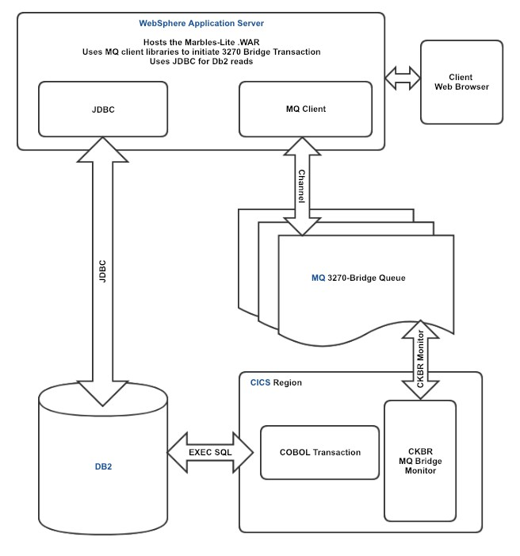
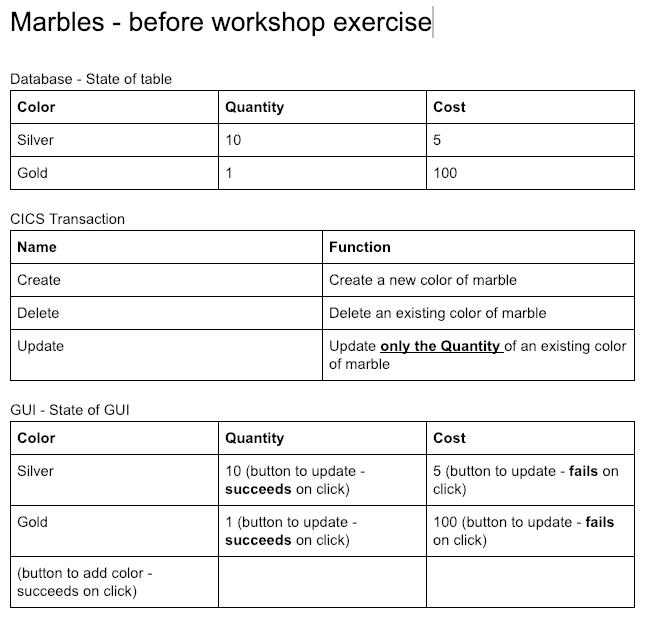
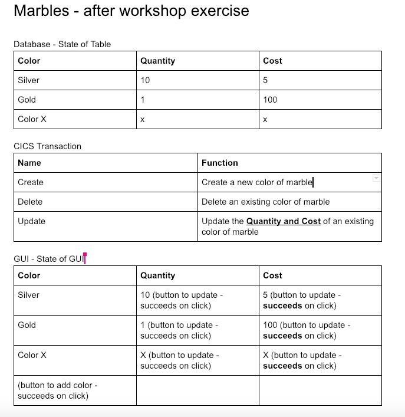
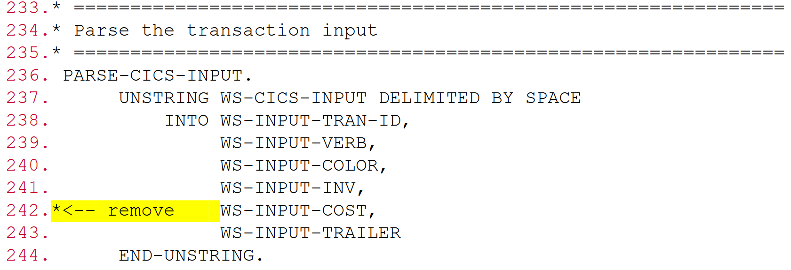
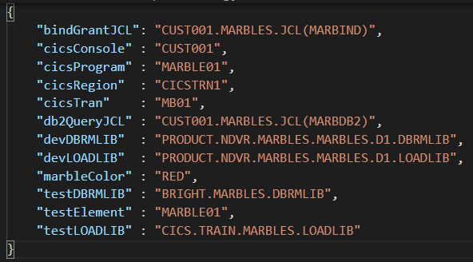
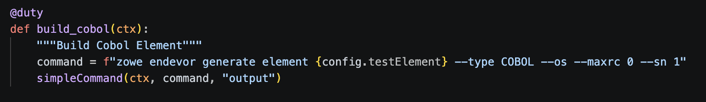
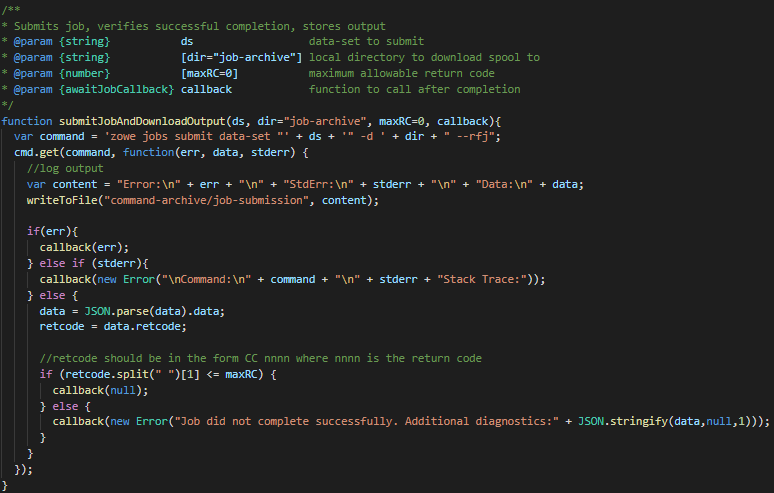

# Zowe CICS Workshop: Automate Mainframe Apps with Jenkins and Zowe

## 1. Goals

- Write automation scripts for mainframe app to build and deploy
- Build a Jenkins CI/CD pipeline for mainframe app

## 2. z/OS Services

- You have been assigned a single set of login credentials for accessing all of the Mainframe resources on a remote z/OS LPAR which is hosted by Broadcom, including TSO, z/OSMF,CICS, Db2 and CA Endevor SCM.
- Your userid is CUST030.
- Your password CUST030.

Service                                                                                                                                                            Connection Information (Host:Port)
z/OSMF                                                                                                                                                             TODO:1443
CICS                                                                                                                                                               TODO:_CICS_PORT_
CA Endevor                                                                                                                                                         TODO:6002

## 3. Marbles

The overall application is desgined with multiple components.  While the application web interface isn't available, we can access the services through JCL and CICS transactions.

## 4. State of Marbles App - Before Workshop
The application has a limitation.  The database contains marble color, quantity and cost.  There's also a CICS transation to create, update and delete marbles.

## 5. Desired State of Marbles App - After Workshop
The application needs to be updates so the cost can be updated.  Luckily, the database already supports the cost information, but the CICS application doesn't update the cost information.  

## 6. Section I: Overview and Environment Setup

## 7. Steps for Section I

- Currently the CICS transaction is able to update the quantity of a marble. We want to enhance this transaction to be able to update the cost of a marble in addition to its existing functionality.
- Steps:
  - Download the COBOL transaction code to your remote desktop from Endevor
  - Edit the code in VS Code
  - Upload the code to Endevor
  - Build (generate) the code on Endevor

- Note: all the following steps should be performed from your assigned remote VS Code environment.

## 8. Developer Environment

- Access the terminal using the Hamburger menu (three horizontal lines), Terminal, New Terminal
  - Issue "zowe --h"
  - Issue "zowe plugins list"
  - Issue "npm -h"
  - Issue "git help"

## 9. Section II: Modify Cobol Code

## 10. Download the element from Endevor - Step 1

- We need to modify a marble.  Your Marble is _MARBLE_NUM_ let's download to our remote desktop using another command.
- Note: The command below uses options provided in the command which take precedence over your default profile. This includes the Endevor system, subsystem, etc.
- Position your terminal to the folder where you want the file downloaded to.
- Download element:
  - zowe endevor retrieve element _MARBLE_NUM_ --type COBOL --to-file _MARBLE_NUM_.cbl --override- signout

## 11. Edit the source code - Step 2

- We are now ready to make the code updates to implement the ability to change the cost of a marble using a CICS transaction.
- Open your source code using the explorer view (Upper Left Corner)
- Find the following code sequence and remove the highlighted text and Save the changes locally:

## 12. Upload the element to Endevor - Step 3

- After making the code changes locally, we need to upload the element to Endevor in order to perform a build.
- Ensure your terminal is positioned to the folder that contains the source file.
- Upload element:
  - `zowe endevor update element _MARBLE_NUM_ --type COBOL --os --ff _MARBLE_NUM_.cbl`

## 13. Generate the code

## 14. Generate the elements

- Now that our code changes have been uploaded to Endevor, we can compile it using an Endevor generate action to see if there are any errors.
- Generate element.
    - There are two --type of elements you want to generate, COBOL and LNK.
    - `zowe endevor generate element _MARBLE_NUM_ --type COBOL --os`
    - `zowe endevor generate element _MARBLE_NUM_ --type LNK --os`
    - HINT: Use your up arrow key and just change the type.

- Ensure that the generate actions are successful:
  - You should see text similar to GENERATE of _MARBLE_NUM_.COBOL finished with 0000 in the output.

## 15. Section III: Deploy Marbles Application Manually

## 16. Deployment - Introduction

- Deployment is another step that is commonly automated. Once you've built your code and binary artifacts like load modules are ready, you may want to copy these artifacts to a system where you can run the program.
- Identify deployment steps
- Identify requirements for parametrization in deployment
  - Do the build artifacts come from a different location depending on whether it's a dev build or a team build?
  - Does the deployment system vary depending on the stage?

- Automate the deployment
- Note: Deployment scripts should be written in a parameterized fashion so that the same script can be used to deploy for devtest, QA, system-test or even production.

## 17. Steps for Section III

- Deployment for marbles requires us to copy the load modules, and activate the changes in the target CICS environment.
  - Deploy manually using CLI commands
  - Create and implement a Deploy duty task
  - Test the deployment

## 18. Deploy manually

- When we generated the LNK element in Endevor in previous sections, Endevor created load modules. We can deploy these load modules to the proper dataset location that CICS is using and refresh CICS to pick up the changes.
- Confirm that the load modules exists in the dataset
  - We can now proceed to list the members in our LOADLIB and DBRMLIB to ensure our MARBLE entry exists.
    - `zowe files list all-members "PRODUCT.NDVR.MARBLES.MARBLES.D1.LOADLIB"`
    - `zowe files list am "PRODUCT.NDVR.MARBLES.MARBLES.D1.DBRMLIB"`

## 19. Deploy manually

- Copy the LOADLIB and DBRMLIB modules to the desired location
  - There are multiple ways to copy load modules using Zowe. For this workshop, we are going to make use of a job to move the elements.
  - Now, let's try to copy our MARBLE element from the source libraries to the destination:
    - `zowe jobs submit data-set "CUST030.MARBLES.JCL(MARBCOPY)" --vasc`

## 20. Deploy manually

- Submit JCL to perform the Bind & Grant
  - `zowe jobs submit data-set "CUST030.MARBLES.JCL(MARBIND)" --view-all-spool-content`
    - This function runs the command and returns all the job content
  - Alternative approach
    - `zowe jobs submit data-set "CUST030.MARBLES.JCL(MARBIND)"`
    - Example returned jobid: JOBXXXXX
    - `zowe jobs view job-status-by-jobid JOBXXXXX`
    - Confirm return code = CC 0004

## 21. Deploy manually

- Activate the transaction changes on CICS
  - We will make use of the CICS plugin to refresh our CICS program.
  - Now, let's try to refresh our CICS program
    - The program that needs refreshed is named Marble.
    - `zowe cics refresh program _MARBLE_NUM_`

## 22. Test manually

- Run the command manually:
  - `zowe console issue command "F CICSTRN1,_CICSTRANS_ CRE _COLOR_ 1 2" --console-name CUST030`
    - Did you get a +SUCCESS message?
  - Check the database
    - `zowe jobs submit ds "CUST030.MARBLES.JCL(MARBDB2)" --vasc`
    - Ensure database contains your marble with quantity and cost

## 24. Section III: Automation Automate the Build

## 25. Automate the Code Build - Introduction

- Now that you've used the CLI to successfully make code changes and perform generates on Endevor, it's time to automate these steps.
- CLI commands can be embedded in scripts that you can run repeatedly from your local machine.
- These same scripts can also be called from CI/CD tools like Jenkins
- Task Runners are a way to organize and interact with your automation scripts more easily.
- We will be using a Python based Task Runner called duty for this section. Task Runners can also be called from CI/CD tools like Jenkins
- Note: Task Runners are an abstraction layer over scripts. They are helpful but are not a necessity.

## 26. Steps for Section III

- Now that you've used the CLI to successfully make code changes and perform generates on Endevor, we want to automate the following:
  - Generate operations for COBOL and LNK
  - Build the application
    - It should generate both the COBOL and LNK elements in a single task

## 27. Starting the Automation

- We have performed some functions for you, like downloading the code and getting it ready.
  - Your code is located in /projects.
  - When you ran the duty command earlier, you used that code.

## 28. Create a Build Task in Duty

- Generating the source element and the LNK element on Endevor are steps that you'll need to perform every time after making code changes to create the load module. It's a great task to automate, so that you don't have to keep doing it manually. Let's start by reviewing our duties.py and existing duty build-cobol task. Then you will create a task in duty called build-lnk.
- Review duties.py: A duties.py is a file in your project directory that automatically loads when you run the duty command.
- At the top of the duties.py, take note of three packages that we are using:
  - `import sys`:  Accesses files and system resources
  - `import duty`: Imports the duty library files
  - `import zowesupport`: A set of helper files to run zowe commands, keeping the duties file simple and easy to understand. 

- Duty is a library of functions.  Without getting to detailed, there's a decorator (@duty) that tells Python the next function is part of the Duty task runner.  
- Python is indention based, similar to COBOL.  Indentation matters. 
- "def build_cobol(ctx):" is a function.
  - def: Declares we are creating a function
  - buid_cobol: This is the function name
  - (ctx): This is a list of parameters.  In this case, we are passing a context object.  You'll also see that for the commands we call.

- """ ... """ indicates a multiline comment.  Using Duty, it is also the description of the task we are calling.  This is a user friendly term used when accessing duty.  

- When the indentation returns to the first column, the previous function ends.  

## 29. Reusable Code - config.json

- Using a configuration file allows the script to remain the same, but passing in variables for the differences.
- Here's a file call config.json containing the values
- Instead of hardcoding the values in the script, the script can read these values.
- To use these values, we can use config.testElement and it will read the color from this file and replace it in the code.

## 30. Create a Build task in duty

- Review build_cobol task
  - Name of task: build_cobol
  - Description of task (in the """ block): Build COBOL element
  - command = f"zowe endevor generate element {config.testElement} --type COBOL --os --maxrc 0 --sn 1"
    - This contains an f-string.  Using {config.testElement}, Python will automatically insert the testElement's name from the config file.  
    - This is much easier to read than Rexx's inline concatenation.  While this example is simple, when using lots of variables, it can become much harder to read. 
    - This version is Python's inline concatentation:
      - command = "zowe endevor generate element " + {config.testElement} + " --type COBOL --os --maxrc 0 --sn 1"
  - simpleCommand runs the command with all the error checking in another section. This is reused a lot, so a function was created to make the code cleaner. The second option includes archiving the output to a directory.

## 31. Create a Build task in duty

- It's important to understand how the simpleCommand works.  
- Using your mouse, right click on simpleCommand.
  - VS Code will open the "zowesupport.py" file and take you to the definition of simpleCommand().

- simpleCommand takes 4 parameters:
  - ctx: The context object for Duty.
  - command: The command to run
  - dir: A directory to write output to.  This is especially useful if you are trying to debug problems.
  - expectedOutputs: This allows us to validate output of the command, if desired.

- This function creates a text variable called output.  It collects all the output from the command, including the command actually called.  It creates a simple format, making it easy to read.
- output = ctx.run(...):  This actually runs the command.  The first parameter is the command to run (passed from simpleCommand).  The second is for formatted output.
- content += : This is a shortcut for appending information to the content variable.
- writeToFile: This calls another function, which writes the content to an output folder.
- if not expectedOutputs: This is used when looking for specific output.  If it doesn't find the output, it ends the application and says why.

## 32. Create a Build-LNK task in duty

- Run duty build-cobol and verify it completes successfully.
  - In the terminal: duty build-cobol
- Create a build-lnk duty task using the build-cobol duty task as a reference.
  - Simply copy the 4 lines (@duty until simpleCommand)
- Ensure the build-lnk task and description appear when you issue duty (without parameters) or duty --help
- Ensure the build-lnk task completes without error when you issue:
  - duty build-lnk

## 33. Combine Build-Cobol and Build-LNK

- Let's take the duty build-cobol and duty build-lnk tasks and combine them into a single duty task. 
  - duty tasks can call any function, including the tasks created in the duty file
- The following duty task combines the existing build tasks into a single duty build task:
  """text 
  @duty
  def build(ctx):
    """Build the application"""
    build_cobol(ctx)
    build_lnk(ctx)
  """
- Ensure the build task and description appear when you issue:
  - `duty --help`
- Ensure the build task runs both the build-cobol and build-lnk tasks without error when you issue:
  - `duty build`

## 34. Completed Build Sequence Command

- Completed

## 35. Section IV: Automate Deployment

## 36. Create and implement a duty Deploy task

- Similar to creating the duty build tasks, we will now create duty tasks to deploy our changes.
  - Review copy task
  - Create the bind-n-grant task
  - Create the cics-refresh task
  - Combine individual deploy tasks into one deploy task.

## 37. Create and implement a duty Deploy task

- Review copy task to copy the LOADLIB and DBRMLIB
  - This task uses a job to copy the lib elements to their destination
  - It uses a function, submitJobAndDownloadOutput(...) to submit the job, check the return code and write the output.
  - It takes 4 parameters:
    - ctx: The Duty context object
    - dataset: This is the name of the dataset and member containing the JCL.
    - folder: This is the folder where the output is stored
    - max return code:  This is a number indicating when an error should be reported

## 38. Implement a duty Bind and Grant task

- Using the copy task, create a bind_and_grant task
  - Duplicate the Duty Copy task, ensure you inlcude the @duty decorator.
  - Paste it and modify the code to look like this:
  """python
  @duty
    def bind_and_grant(ctx):
    """Run Bind and Grant Jobs"""
    dataset = f"{config.bindGrantJCL}"
    submitJobAndDownloadOutput(ctx, dataset, "job-archive", 4)

  """

  - The bind-n-grant task to submit MARBIND JCL and verify CC <= 0004

## 39. Review submitJobAndDownloadOutput

- Just like before, find "submitJobAndDownloadOutput", right click and select "Go To Definition".

- submitJobAndDownloadOutput submits the dataset
  - it takes 4 outputs, 3 are required:
    - ctx: Context, used by Duty
    - dataset: The dataset name and member
    - dir: Folder to store the output
    - maxRC: This is defaulted to 0, but it can be overridden to allow higher return codes without throwing an error.

  It does the following:
    - command: contains the command to run, in this case "zowe jobs submit dataset" with the required parameters
    - content: This is a text variable to capture the output from the commands to be written to screen and/or files.
    - output: This is the output from running executing ctx.run(), which runs the command set in the command variable.
    - data: DotMap converts a python dictionary into a JSON object, the same output type as Zowe commands (using the --rfj flag).  It makes it easier to access elements in the output.

  - The command uses the "-d" flag. This flag says to execute the job, wait for the job to complete, then download the output. 
  - It checks for errors
  - If there's an error, that is returned to the calling task
  - Captures output and writes it to disk

## 40. CICS NewCopy/Refresh
  - In order to execute the new code, it must be refreshed into CICS.
  - Zowe offers a command to perform this function.
    - `zowe cics refresh program _MARBLE_NUM_`

  - Let's create it so it uses the config file:
    - copy the simpleCommand implementation. Use something like build_link or build_cobol
    - paste it and modify the name, the description (in the """ block), and command.
    - Use an f-string to pass the program from the configuration file so the file isn't hard coded to a single marble. 

  - It should look something like this:
  """python 
  @duty
    def cics_refresh(ctx):
    """Refresh CICS Program"""
    command = f"zowe cics refresh program {config.cicsProgram}"
    simpleCommand(ctx, command, "output")
  """

## 41. Combine the tasks
- The Copy, Bind-n-Grant and CICS Refresh functions have been created
- Let's combine them into a single task, so we can run all the command using a single command
  - Using the code you created to combine the build-cobol and build-lnk tasks into a single build task as a reference, combine the following tasks into a single deploy task that will deploy the program using:
    - copy
    - bind-n-grant
    - cics-refresh
  - Ensure the tasks run in the correct order
  - Ensure your task appears when issuing duty --help
  - Run duty deploy
  - Ensure your task completes without error

- The code should look like this:
"""python
@duty
  def deploy(ctx):
    """Deploy the application"""
    copy(ctx)
    bind_and_grant(ctx)
    cics_refresh(ctx)
"""

## 42. Section VI: Add Code Build to Continuous Integration

## 43. Workshop Environment

## 44. Continuous Integration - Introduction

- Task runners help individual developers run their automation scripts easily and avoid wasting time doing mundane tasks. We can take this one step further and allow many of these tasks to be performed by CI orchestrators when code changes occur in a shared team repository.
  - Identify tasks that need to be performed after code changes are made at a shared level.
  - Create stages in CI orchestrators for these tasks
  - Call automated scripts from these stages

- Note: In addition to automating these steps from CI, you will likely want to automate the trigger of the CI process from the shared code repository when code changes occur.

## 45. Steps for Section VI

- In our case, the build step is a common one that could be performed from CI once a code change is made in Endevor. Let's add it to a Jenkins pipeline.
- Log in to Jenkins, view Workshop_030 project, and verify pipeline runs.
- Review Jenkinsfile
- Enhance Jenkinsfile to build project
  - Enhance build stage in Jenkinsfile to run duty build, duty deploy and npm test
  - Add Environment variables to supply connection and project details.

- Manually kick off the pipeline to test

## 46. Jenkinsfile Overview Terms

- Pipeline - defines the overall pipeline structure
- Agent - defines where the code will execute
- Environment - defines the environment variables for use in other commands
- Stages - defines the start of the stages
- Stage - defines each stage
- Post - performed after running the stages section

## 47. Jenkinsfile

- To ease troubleshooting and ensure everything is set up, local setup does the following:
  - Verifies version of node, npm, zowe, zowe plugins
  - Installs duty-cli
  - Installs npm dependencies
- This ensure all thecomponents are available.
- It then creates dummy profiles, so the code is cleaner. These profiles are destroyed when the run finishes. This provides cleaner code, but still has security as usernames, passwords and hostnames are obfuscated.

## 48. Log in to Jenkins

- Jenkins is a hosted application running on a web server. You can access it from most web browsers.
- Log in to Jenkins: http://mfwsone.broadcom.com/jenkins/
  - Username: workshop_030
  - Password: 030_workshop

- Verify that the environment is in the right starting state
  - Click on the name of your project (Workshop_030)
  - Select the master branch
  - Click Build Now in the left side menu and verify the project builds successfully.
    - Build Now icon is shown below.

## 49. Review Jenkinsfile

- A Jenkinsfile is a text file that contains the definition of a Jenkins Pipeline and is checked into source control. Using a Jenkinsfile, which is checked into source control, enables
  - Code review/iteration on the pipeline
  - Audit trail for the pipeline
  - Single source of truth for the pipeline

- More detailed information is available at https://jenkins.io/doc/book/pipeline/jenkinsfile/

## 50. Review Jenkinsfile

- Environment variables can be declared within an environment directive or with a withEnv step.
  - An environment directive in the top-level pipeline block applies to all steps within the pipeline
  - An environment directive within a stage will only apply those variables to that stage.

- The stages directive contains various pipeline stages and the steps directive provides the tasks for each stage.

## 51. Updating the Jenkinsfile

- Implement the Build stage by calling the Build duty task.
  - Locate the build stage in your Jenkinsfile
  - Remove the following line of code which simply echoed out a statement:
    - sh "echo build"

- Uncomment the ensuing withCredentials code block.
  - Inside this block, we will have access to eosCreds. It is defined in Jenkins.
  - We define the user environment variable to be ZOWE_OPT_USER and the password to be ZOWE_OPT_PASSWORD because Zowe can be influenced by environment variables.
  - Let's take a moment to discuss command line precedence.

## 52. Zowe Command Line Precedence

- You can specify any option on any command through the use of environment variables using the prefix ZOWE_OPT_.
- For example, you can specify the option --host by setting an environment variable named ZOWE_OPT_HOST to the desired value.
- For more information on defining environment variables, please reference: https://docs.zowe.org/stable/user-guide/cli-configuringcli.html#defining-environment-variables
- When a Zowe command is run, the order of precedence for determining the option values to use is:
  - Command line arguments
  - Environment variables
  - Profile settings
  - Default values

## 53. Updating the Jenkinsfile

- Add the following command inside the withCredentials block to instruct Jenkins to run the duty build task you created as part of build stage:
  - sh 'duty build'

## 54. Enhance Jenkinsfile for Deploy

- Deployment for marbles requires us to copy the load modules, and activate the changes in the target CICS environment.
  - Deploy manually using CLI commands
  - Create and implement a Deploy duty task
  - Create and implement a Deploy Jenkins stage

## 55. Create and implement a Deploy Jenkins stage - Step 4

- Implement Deploy stage
  - Uncomment withCredentials block
  - Call the duty deploy task that you created. This will need placed inside the inner withCredentials block.
  - Note: Plugins also inherit the ZOWE_OPT_ vars, but can be overridden on the command line.

## 59. Run the pipeline

  - Commit and Push Code to GitHub
  - Log in to Jenkins and build your project
    - Debug any issues that may arise. Reach out to facilitator for guidance if needed.

## 60. Commit and push changes to GitHub

- To Review the files you have changed before committing:
  - `git status`
- There may endevor reports you wish to delete, commit or only keep locally.
  - If you wish to only keep them locally, add endevor-report*.txt to your .gitignore file in your project's root directory. You can run git status again to verify you no longer see the endevor-report files.
- Commit your changes when satisfied:
  - `git commit -a -m "Add duty build tasks"`

## 61. Commit and push changes to GitHub

- Push your changes to GitHub:
  - `git push`

## 62. Log in to Jenkins

- Jenkins is a hosted application running on a web server. You can access it from most web browsers.
- Log in to Jenkins: http://mfwsone.broadcom.com/jenkins/
  - Username: _JENKINSCUST030
  - Password: Mfuser30@26

- Verify that the environment is in the right starting state
  - Click on the name of your project (Workshop_030)
  - Select the master branch
  - Click Build Now in the left side menu and verify the project builds successfully.

## 65. Thank You
